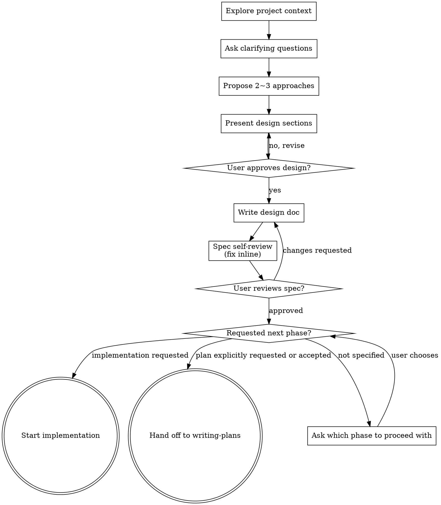

# Brainstorming Ideas Into Designs

Turn ideas into fully formed designs and specs through natural collaborative dialogue.

Start by understanding the current project context, then ask questions one at a time to refine the idea.
Once you understand what you're building, present the design and get user approval.

<HARD-GATE>
Do NOT write any code, scaffold any project, or take any implementation action until you have presented a design and the user has approved it.
This applies to EVERY project regardless of perceived simplicity.
An existing approved design satisfies this gate; reuse it when the user requests implementation.
A separate implementation plan document is not required to leave this skill.
</HARD-GATE>

## Anti-Pattern: "This Is Too Simple To Need A Design"

Every project goes through this process.
A todo list, a single-function utility, a config change — all of them.
"Simple" projects are where unexamined assumptions cause the most wasted work.
The design can be short (a few sentences for truly simple projects), but you MUST present it and get approval.

## Checklist

Create a task for each of these items and complete them in order:

1. **Explore project context** — check files, docs, recent commits
2. **Ask clarifying questions** — one at a time; understand purpose, constraints, success criteria
3. **Propose 2 ~ 3 approaches** — with trade-offs and your recommendation
4. **Present design** — in sections scaled to their complexity; get user approval after each section
5. **Write design doc** — save to `docs/specs/YYYY-MM-DD-<topic>-design.md`
6. **Spec self-review** — inline check for placeholders, contradictions, ambiguity, scope
7. **User reviews written spec** — ask the user to review the spec file before proceeding
8. **Follow the requested phase** — after spec approval, start implementation when requested; invoke writing-plans only for an explicit plan request or explicit acceptance of an offer to write one

## Process Flow

## The Process

**Understanding the idea:**

- Check the current project state first (files, docs, recent commits)
- Before asking detailed questions, assess scope.
  If the request describes multiple independent subsystems (e.g. "build a platform with chat, file storage, billing, and analytics"), flag this immediately.
  Don't spend questions refining details of a project that needs to be decomposed first.
- If the project is too large for a single spec, help the user decompose it into sub-projects:
  what are the independent pieces, how do they relate, what order should they be built?
  Then brainstorm the first sub-project through the normal design flow.
  Each sub-project gets its own approved spec and implementation; add a separate plan only when explicitly requested or accepted.
- For appropriately-scoped projects, ask questions one at a time to refine the idea
- Prefer multiple choice questions when possible, but open-ended is fine too
- Only one question per message — if a topic needs more exploration, break it into multiple questions
- Focus on understanding: purpose, constraints, success criteria

**Exploring approaches:**

- Propose 2 ~ 3 different approaches with trade-offs
- Present options conversationally with your recommendation and reasoning
- Lead with your recommended option and explain why
- YAGNI ruthlessly — remove unnecessary features from every approach and design

**Presenting the design:**

- Once you believe you understand what you're building, present the design
- Scale each section to its complexity: a few sentences if straightforward, up to 200 ~ 300 words if nuanced
- Ask after each section whether it looks right so far
- Cover: architecture, components, data flow, error handling, testing
- Be ready to go back and clarify if something doesn't make sense

**Design for isolation and clarity:**

- Break the system into smaller units that each have one clear purpose, communicate through well-defined interfaces, and can be understood and tested independently
- For each unit, you should be able to answer: what does it do, how do you use it, and what does it depend on?
- Can someone understand what a unit does without reading its internals?
  Can you change the internals without breaking consumers?
  If not, the boundaries need work.
- Smaller, well-bounded units are also easier to work with — you reason better about code you can hold in context at once, and edits are more reliable when files are focused.
  When a file grows large, that's often a signal it's doing too much.

**Working in existing codebases:**

- Explore the current structure before proposing changes. Follow existing patterns.
- Where existing code has problems that affect the work (e.g. a file that's grown too large, unclear boundaries, tangled responsibilities), include targeted improvements as part of the design — the way a good developer improves code they're working in.
- Don't propose unrelated refactoring. Stay focused on what serves the current goal.

## After the Design

**Documentation:**

- Write the validated design (spec) to `docs/specs/YYYY-MM-DD-<topic>-design.md`
  - User preferences for spec location override this default

**Spec self-review:**

After writing the spec document, look at it with fresh eyes:

1. **Placeholder scan** — any "TBD", "TODO", incomplete sections, or vague requirements? Fix them.
2. **Internal consistency** — do any sections contradict each other? Does the architecture match the feature descriptions?
3. **Scope check** — is this focused enough for a single implementation plan, or does it need decomposition?
4. **Ambiguity check** — could any requirement be interpreted two different ways? If so, pick one and make it explicit.

Fix any issues inline. No need to re-review — just fix and move on.

**User review gate:**

After the spec self-review passes, ask the user to review the written spec before proceeding:

> "설계 문서를 `<path>`에 작성했어. 검토하고 수정할 부분이 있으면 알려줘."

Wait for the user's response.
If they request changes, make them and re-run the spec self-review.
Only proceed once the user approves.

**Implementation hand-off:**

Once the spec is approved, follow the user's requested phase:

- **Implementation requested** ("구현하자", "구현해줘", "이대로 만들어줘", "implement this"): Start implementation using the approved spec and any existing plan.
  A missing plan file does not require writing-plans or another planning approval.
  Organize implementation steps as needed without creating a separate plan document and approval phase.
- **Plan explicitly requested or accepted:** Invoke the `writing-plans` skill and pass it the spec path.
  That skill owns the implementation plan; do not draft it here.
- **Design approved without a next action:** Ask which phase the user wants next; approval alone is not consent to write a plan.
- **Short agreement** ("좋아", "진행해", "go ahead"): Resolve against the preceding proposal.
  Agreement to implement means implementation; agreement to an explicit plan-writing offer means planning.
- **Changes requested:** Revise the spec and repeat its self-review and approval.

If a core decision still blocks implementation, ask about that decision rather than restarting the entire design/planning workflow.
